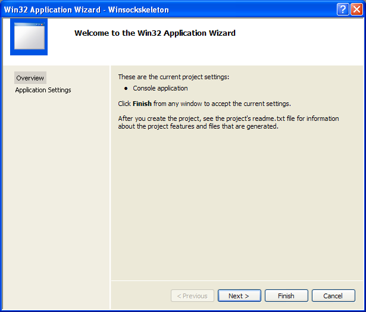
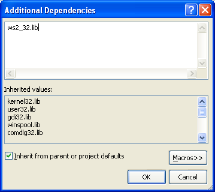

# Windows Socket编程的介绍

Winsock是一个标准的应用程序接口(API),它允许两台或多台计算机上的应用程序(或进程)在同一台机器上或通过网络进行通信,其主要目的是促进网络上的数据通信。需要理解的是,Winsock是一个网络编程接口,而不是一个协议。Winsock为应用程序提供了使用流行的网络协议(如传输控制协议/因特网协议TCP/IP和Internetwork分组交换IPX)进行通信的编程接口。Winsock接口继承了UNIX平台上的BSD套接字实现中的大量功能。在Windows环境中,该接口已经发展成为一个真正的与协议无关的接口,特别是在Winsock 2发布之后。

本章中的示例有助于理解接收连接、建立连接以及发送和接收数据所需的Winsock调用。由于本章的目的是学习这些基本的Winsock调用,所以示例中使用的是简单的阻塞Winsock调用。

您可以通过WSA前缀来区分这两个函数。如果Winsock 2在其规范中更新或添加了新的API函数,则函数名前缀为WSA。例如,Winsock 1中的创建套接字函数简单地称为socket()。Winsock 2引入了一个名为WSASocket()的新版本,它能够使用Winsock 2中提供的一些新功能。这个命名规则有少数例外。WSAStartup()、WSACleanup()、WSARecvEx()和WSAGetLastError()都在Winsock 1.1规范中。如果您在计算机或编程环境中找不到相关的Winsock头文件,您可能需要先阅读Visual .NET文档1和Visual .NET文档2文章。这些文章还展示了如何将Winsock链接库ws2_32.lib添加到Visual C++项目中。

## 1. WinSock 头文件与库 （Winsock Headers and Libraries）

开发新应用程序时,遵循Winsock 2规范应该在应用程序中包含WINSOCK2.H。 为了与旧的Winsock应用程序兼容,以及在Windows CE平台上开发时,提供了WINSOCK.H。 还有一个额外的头文件:MSWSOCK.H,它针对的是通常用于开发高性能Winsock应用程序的Microsoft特定编程扩展。

当使用WINSOCK2.H编译应用程序时,应该链接WS2_32.LIB库。 当在Windows CE上使用WINSOCK.H时,应使用WSOCK32.LIB。 如果您使用MSWSOCK.H中的扩展API,还必须链接到MSWSOCK.LIB。 一旦您包含了必要的头文件和链接环境,就可以开始编码应用程序了,这需要初始化Winsock。

## 2. 初始化Winsock（Initializing Winsock）

每个Winsock应用程序都必须加载适当版本的Winsock DLL。 如果在调用Winsock函数之前未加载Winsock库,则该函数返回SOCKET_ERROR; 错误将是WSANOTINITIALISED。 通过调用WSAStartup()函数来加载Winsock库,定义如下:

```C
 int WSAStartup(
    WORD wVersionRequested,
    LPWSADATA lpWSAData
);
```
wVersionRequested参数用于指定要加载的Winsock库的版本。 高字节指定请求的Winsock库的次要版本,而低字节是主版本。 您可以使用方便的宏MAKEWORD(x,y),其中x是高字节,y是低字节,以获得wVersionRequested的正确值。 lpWSAData参数是指向LPWSADATA结构的指针,WSAStartup()用与它加载的库的版本相关的信息填充该结构:

```C
typedef struct WSAData {
    WORD           wVersion;
    WORD           wHighVersion;
    char           szDescription[WSADESCRIPTION_LEN + 1];
    char           szSystemStatus[WSASYS_STATUS_LEN + 1];
    unsigned short iMaxSockets;
    unsigned short iMaxUdpDg;
    char FAR *     lpVendorInfo;
} WSADATA, * LPWSADATA;
```

WSAStartup() 将第一个字段wVersion设置为您将使用的Winsock版本。 wHighVersion参数保存可用的Winsock库的最高版本。 请记住,在这两个字段中,高阶字节表示Winsock次版本,低阶字节是主版本。 szDescription和szSystemStatus字段由Winsock的特定实现设置,实际上没有什么用处。 不要使用下两个字段iMaxSockets和iMaxUdpDg。 它们应该是最大并发打开套接字数和最大数据报大小; 然而,要查找最大数据报大小,应通过WSAEnumProtocols()查询协议信息。

最大并发套接字数不是某个神奇的数字,它更取决于可用的物理资源。 最后,lpVendorInfo字段保留供特定于实现Winsock的供应商信息使用。 此字段在任何Windows平台上都不使用。

在大多数情况下,编写新应用程序时,您将加载当前可用的最新Winsock库版本。 请记住,例如,如果发布Winsock 3,您的加载版本2.2的应用程序应该照常运行。 如果您请求比平台支持的版本更高的Winsock版本,WSAStartup()将失败。 返回后,WSADATA结构的wHighVersion将是库在当前系统上支持的最新版本。 当应用程序完全停止使用Winsock接口时,应调用WSACleanup(),以允许Winsock释放Winsock分配的任何资源并取消应用程序发出的任何待处理的Winsock调用。 WSACleanup()定义如下:

```C
int WSACleanup(void);
```

当应用程序退出时不调用WSACleanup不是有害的,因为操作系统将自动释放资源; 但是,您的应用程序将不遵循Winsock规范。 此外,应为对WSAStartup()的每次调用调用WSACleanup()。

## 3. 错误检查和处理（Error Checking and Handling）

首先,我们将介绍错误检查和处理,因为它们对于编写成功的Winsock应用程序至关重要。 Winsock函数返回错误实际上很常见; 然而,在某些情况下,错误是不严重的问题,套接字上的通信仍可以进行。 对不成功的Winsock调用最常见的返回值是SOCKET_ERROR,尽管这肯定不总是如此。 在详细介绍每个API调用时,我们将指出与错误相对应的返回值。 常量SOCKET_ERROR实际上是-1。 如果对Winsock函数的调用出现错误,可以使用WSAGetLastError()函数获取特定错误的错误代码。 此函数定义如下:

```C
int WSAGetLastError(void);
```

发生错误后对该函数的调用将返回发生的特定错误的整数代码。 从WSAGetLastError()返回的这些错误代码都具有预定义的常量值,这些常量值在WINSOCK.H或WINSOCK2.H中声明,具体取决于Winsock的版本。 这两个头文件的唯一区别在于WINSOCK2.H包含了一些在Winsock 2中引入的较新的API函数和功能的更多错误代码。 定义各种错误代码的常量(用#define指令)通常以WSAE开头。 另有WSASetLastError()函数,它允许您手动设置WSAGetLastError()检索的错误代码。
以下程序演示了如何基于我们目前讨论的内容构建一个Winsock框架程序：

```C
#include <winsock2.h>

void main(void)
{

   WSADATA wsaData;
 
   // Initialize Winsock version 2.2
   if ((Ret = WSAStartup(MAKEWORD(2,2), &wsaData)) != 0)
   {
      printf("WSAStartup failed with error %ld\n", WSAGetLastError());
      return;
   }

   // Setup Winsock communication code here
   // When your application is finished call WSACleanup

   if (WSACleanup() == SOCKET_ERROR)
   {
      printf("WSACleanup failed with error %d\n", WSAGetLastError());
   }
}
```

下面，让我们在Visual C++ 2008 Express Edition上测试一下这个程序。首先,我们可以更改新安装的 VC++ 启动页面以加载上次加载的解决方案。您可以跳过此“可选”步骤。单击“Tools”菜单>“Options”子菜单


展开“Environment”文件夹>选择“Startup”链接>将“启动时”设置为“Load last loaded solution”>单击“OK”。


1. 然后,我们可以开始创建 Win32 Console Application项目。单击“File”菜单>“Project”子菜单以创建新项目。

   
2. 对于“项目类型”:选择 Win32, 对于“模板”: 选择 Win32 Console Application。输入项目和解决方案名称。如果需要,请调整项目位置,然后单击“OK”。
   
3. 单击“Win32 Application Wizard Overview”页面上的“Next”。我们将删除所有不必要的项目项。
   
4. 在“Application Settings”页面上,为“Additional”:选择“Empty Project”。将其他内容保留为给定的,然后单击“Finish”。
   
5. 接下来,我们需要添加新的源文件。单击“Project”菜单>“Add New Item”子菜单,或在解决方案资源管理器中选择Solution Explorer>选择“Add”菜单>选择“New Item”子菜单。
   

   
6. 对于“Templates”:,选择 C++ File (.cpp)。输入源文件名,然后单击“Add”。 尽管扩展名是 .cpp,但基于稍后在项目属性页面中设置的编译为 C 代码(/TC)选项,Visual C++ IDE 将识别出所使用的源代码基于 C。
   
7. 现在,添加如下所示的源代码。
   ```C
   #include <winsock2.h>
   #include <stdio.h>

   int main(void)
   {
      WSADATA wsaData;
      int RetCode;

      // Initialize Winsock version 2.2
      if ((RetCode = WSAStartup(MAKEWORD(2, 2), &wsaData)) != 0)
      {
         printf("WSAStartup failed with error %d\n", RetCode);
         return 1;
      }

      else
      {
         printf("The Winsock dll found!\n");
         printf("The current status is: %s.\n", wsaData.szSystemStatus);
      }

      if (LOBYTE(wsaData.wVersion) != 2 || HIBYTE(wsaData.wVersion) != 2)
      {
         // Tell the user that we could not find a usable WinSock DLL
         printf("The dll do not support the Winsock version %u.%u!\n",
                  LOBYTE(wsaData.wVersion), HIBYTE(wsaData.wVersion));

         // When your application is finished call WSACleanup
         WSACleanup();

         // and exit
         return 0;

      }
      else
      {
         printf("The dll supports the Winsock version %u.%u!\n",
                  LOBYTE(wsaData.wVersion),
                  HIBYTE(wsaData.wVersion));

         printf("The highest version this dll can support: %u.%u\n",
                  LOBYTE(wsaData.wHighVersion),
                  HIBYTE(wsaData.wHighVersion));

         // Setup Winsock communication code here
         // When your application is finished call WSACleanup
         if (WSACleanup() == SOCKET_ERROR)
            printf("WSACleanup failed with error %d\n", WSAGetLastError());

         // and exit
         return 1;
      }
   }
   ```
8. 在我们可以构建此 Winsock C Win32 控制台应用程序项目之前,我们需要将项目设置为编译为 C 代码,并链接到 ws2_32.lib,即 Winsock2 库。调用项目属性页面。
   
9. 展开“Configuration”文件夹>展开“C/C++”子文件夹。选择“Advanced”链接,对于“Compile As”选项,选择“Compile as C Code (/TC)”。
   
10. 接下来,展开“Linker”文件夹并选择“Input”链接。 对于“Additional Dependencies”选项,单击右侧空字段末尾的省略号。
   
11. 手动键入库名称并单击“OK”。
   
12. 或者,您可以直接在“Additional Dependencies”的右侧空字段中键入库名称。 单击“OK”。
   
13. 生成项目,并确保没有错误(如果有),通常可以在 IDE 默认停靠在底部的输出窗口中看到错误。
   
14. 运行项目。
   
15. 如果没有错误,预期的输出示例如下所示。
   
好了,完成这个练习后,您应该熟悉创建空 Win32 控制台应用程序项目的步骤。 这些步骤将在本教程中的几乎所有 Winsock2 项目中重复。 现在我们准备好如何使用网络协议进行通信。